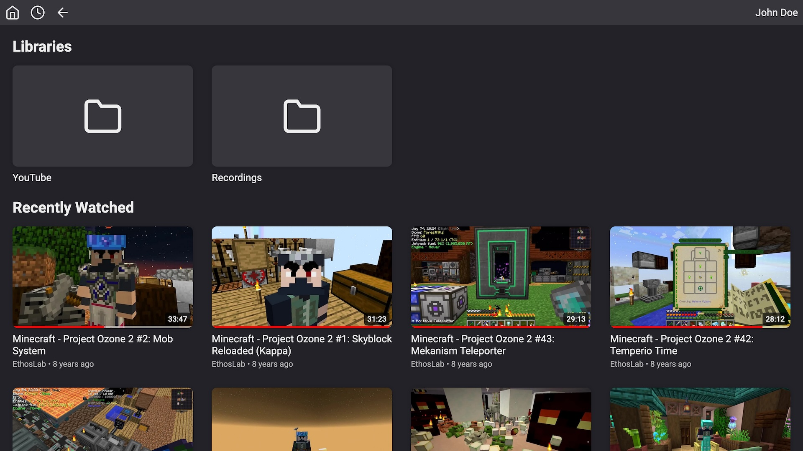
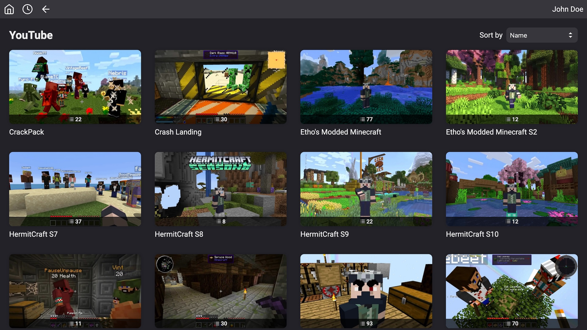
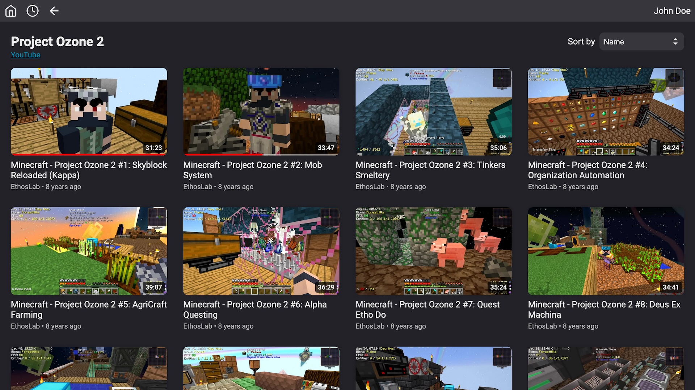
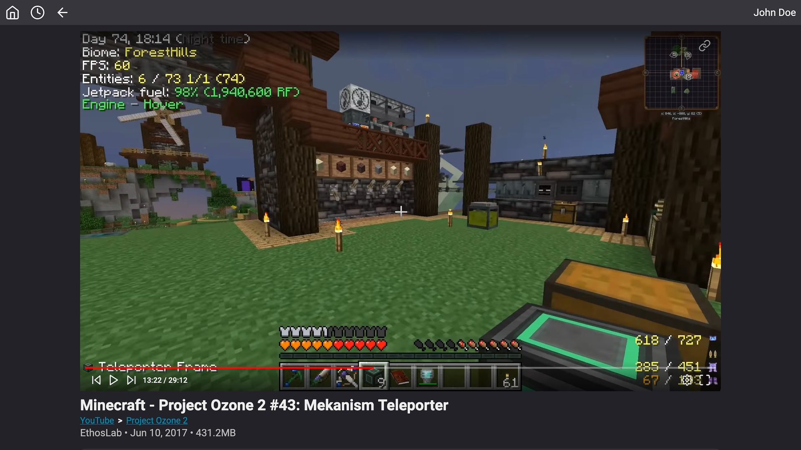
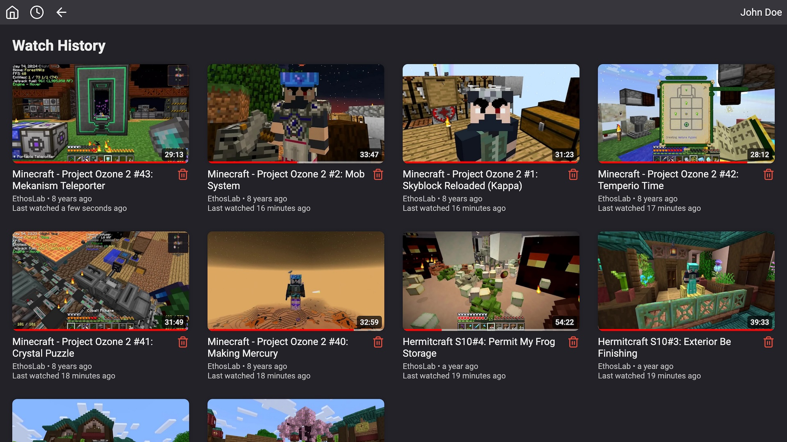

# Simple Media Server

Simple Media Server is a lightweight media server mainly intended for hosting home videos or downloaded
YouTube videos.

## Features

- **Lightweight** - Simple Media Server never does any background tasks like indexing or pre-processing videos.
  Video files are only read when somebody views them.
- **Preserves directory structure** - Organize your videos using folders on your file system and Simple Media Server
  will serve your videos using the same structure.
- **Supports youtube-dl Metadata** - Simple Media Server will use metadata embedded by
  [youtube-dl](https://github.com/ytdl-org/youtube-dl) to show a video's author, publish date, and description.
- **Tracks watch history** - Simple Media Server keeps track of your watch history and remembers where you left off
  on a video.
- **Multiple users** - Simple Media Server supports multiple user accounts to separate watch histories and control
  library access.
- **Hardware transcoding** - Simple Media Server supports hardware transcoding for videos that can't be played natively
  on a device. Hardware transcoding must be enabled in the config file to work. Currently only Intel Quick Sync is
  supported.

## Gallery


_Home page_


_Viewing a library_


_Viewing a directory_


_Watching a video_


_Viewing watch history_

## Building

Building is easiest using Docker Compose. First, make sure you have [Docker](https://docs.docker.com/get-started/get-docker/)
installed and running. Then build the container using
```shell
docker compose build
```

## Running

An example configuration is present in the `example` directory.
Place any videos that you want to serve inside of `example/example-library` and start
the server using
```shell
docker compose up
```
You can then navigate to http://localhost:8000/ and login with `test` for both the username and password.

To create your own configuration, copy the config files in `example/config`, modify them, and then create your own
Docker Compose file pointing to your config directory.
